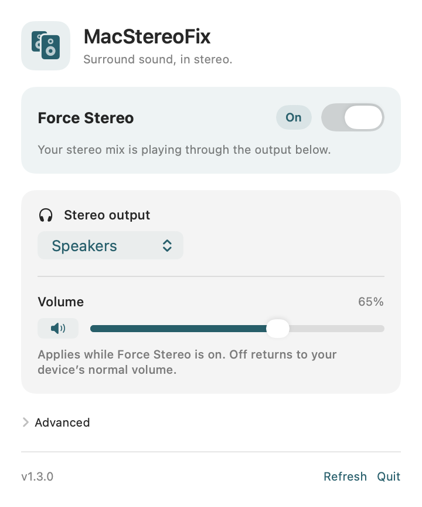
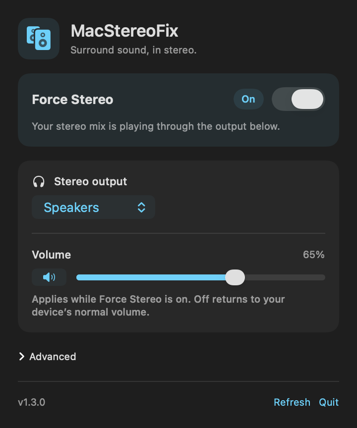

# MacStereoFix

MacStereoFix is a macOS menu bar utility that downmixes surround audio to stereo,
including the center channel that carries dialogue in many games. It is useful
when a game sends surround audio but you listen through stereo speakers or headphones.

**Version 1.3.0 is an unreleased audit candidate.** The published
[v1.2 download](https://github.com/macprotips/MacStereoFix/releases/tag/v1.2) does not
contain the safety and recovery changes on this branch. A new release must pass
[the release checklist](docs/RELEASE_CHECKLIST.md) before distribution.

## Interface preview

<table><tr>
<td></td>
<td></td>
</tr></table>

Rendered from the candidate interface with a sample output; hardware testing is pending.

## What it does

The app installs a user-space CoreAudio HAL plug-in, not a kernel extension.
When you turn **Force Stereo** on, it reads eight-channel, 48 kHz PCM from that
virtual device, mixes it to stereo, and sends the result to your selected output.
Apps that follow the macOS default output then use this route. Apps that select
their own output, system alerts, and protected audio may behave differently.

Supported destinations have at least two output channels at 32–192 kHz.
Apple's audio converter handles output sample-rate conversion and small clock
differences. Virtual and aggregate destinations are excluded to avoid feedback.
Bluetooth call modes with only one output channel are not supported.

- **Volume and mute:** attenuate routed audio without changing hardware volume
  or left/right balance. Turning Off returns to the device's normal volume.
- **Off and Quit:** attempt to restore the previous output, with a connected
  physical fallback if it disappeared. A small child process also attempts this
  if the app crashes or is force-quit. It exits afterward and has no login item.
- **Sleep, device loss, routing errors, and manual output changes:** stop routing.
  The app starts off at each launch and does not automatically resume capture.
- **Optional dialogue boost:** under **Advanced**, 0–9 dB above the base center
  coefficient. Off (0 dB) by default; an explicitly saved setting is retained.

The mix is `L + Cgain*C + 0.707*Ls + 0.5*Lsr` and the corresponding right channels.
`Cgain = 0.707 * 10^(boost/20)`. LFE is omitted. Invalid samples are silenced and
mix peaks are clipped before software attenuation. More dialogue boost can
cause audible distortion in loud scenes; begin at a low listening volume.

## Install a verified release

1. Download a signed and notarized release from this repository, unzip it, and
   move `MacStereoFix.app` to Applications.
2. Open it and use the speaker icon in the menu bar.
3. Finish calls and recordings, then click **Install Audio Driver…**. macOS asks for an
   administrator password. Installing, updating, or removing the driver briefly
   interrupts **all Mac audio** while CoreAudio restarts.
4. Select your speakers or headphones and turn **Force Stereo** on.
5. Allow the macOS microphone permission prompt. The app reads the virtual
   device, not your physical microphone. Permission denial leaves normal output
   in place. See [privacy details](PRIVACY.md).

The app verifies the staged driver's signature and developer identity before
replacing an existing installation. It also checks that the current driver
version is actually loaded, not merely copied onto disk.

If macOS reports an unidentified developer, damage, or an unverifiable app,
stop and download a verified release. Do not disable Gatekeeper, SIP, or other
macOS protections to install MacStereoFix.

## If sound stops

Open **System Settings → Sound → Output** and select your normal speakers or
headphones. This bypasses MacStereoFix immediately. Do not select MacStereoFix
manually while its app is off.

If the app cannot start capture, check **Privacy & Security → Microphone**.
If an updated driver does not load, restart the Mac. For a Bluetooth device in
call mode, end the call or select another stereo output. Re-enable Force Stereo
only after the intended output is available.

## Remove it

Use **Advanced → Uninstall…**, then move the app from Applications to the
Trash. The app stops routing first. Removal needs administrator authorization
and briefly interrupts Mac audio.

Developers can select a normal output, quit the app, then run `sudo ./uninstall.sh`.
The script removes only `/Library/Audio/Plug-Ins/HAL/MacStereoFix.driver` and
restarts CoreAudio. Preferences can optionally be removed with
`defaults delete com.macstereofix.app`.

## Build and verify

Requires macOS, Xcode 15 or newer (or matching Command Line Tools), Swift 5.9+,
and the system Python 3 supplied with those tools. The deployment target is
macOS 13. Both Apple Silicon and Intel binaries are built. Actual OS/device
coverage is tracked in the release checklist; cross-compiling alone is not proof
of compatibility.

```sh
./build.sh
./check.sh
```

Builds go into `build/`. With no signing identity, these are **local development
builds only**. The in-app installer intentionally rejects ad-hoc drivers.
Developers who trust their own checkout may explicitly use
`sudo ./install.sh --allow-adhoc` for local testing; this is not a distribution path.

The automated checks do not install a driver, capture audio, change output
settings, or kill CoreAudio. They exercise the driver under AddressSanitizer,
UndefinedBehaviorSanitizer and ThreadSanitizer; the production mixer/converter;
routing failures; installer rollback and quoting; and crash recovery with test
doubles. GitHub Actions runs them on Apple Silicon and Intel.

## Produce a release

Complete [docs/RELEASE_CHECKLIST.md](docs/RELEASE_CHECKLIST.md) on the exact source
commit. Use your Developer ID Application certificate and an existing
`notarytool` Keychain profile. Do not put passwords or private keys in the repository.

```sh
SIGN_IDENTITY='Developer ID Application: Your Name (TEAMID)' \
NOTARY_PROFILE='your-saved-profile' \
RELEASE_TESTED_COMMIT='the-full-tested-commit-sha' \
./release.sh
```

The project pins installation to its current developer team, `MD83L42DNL`.
Changing that identity is an explicit trust change, not just a build setting.

The release script requires a clean checkout, builds and runs the checks, verifies
signatures, waits for Apple's acceptance, staples the ticket, checks Gatekeeper,
and verifies the extracted final ZIP. Only then does it emit a versioned archive
and SHA-256 checksum. It does not publish anything to GitHub.

## Scope and licensing

No per-app routing, bitstream passthrough, Dolby/DTS decoding, HRTF, automatic
updater, telemetry, or third-party runtime packages. macOS handles the input
conversion from app formats to the virtual device's 48 kHz PCM stream.

The existing project policy is personal use among friends; this audit does not
add a new open-source license or grant additional reuse rights. The driver is
modeled on Apple's NullAudio sample. Its notice is preserved in
[ThirdParty](ThirdParty/README.md) and included in the built app and driver.
